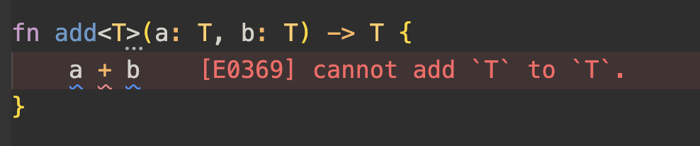
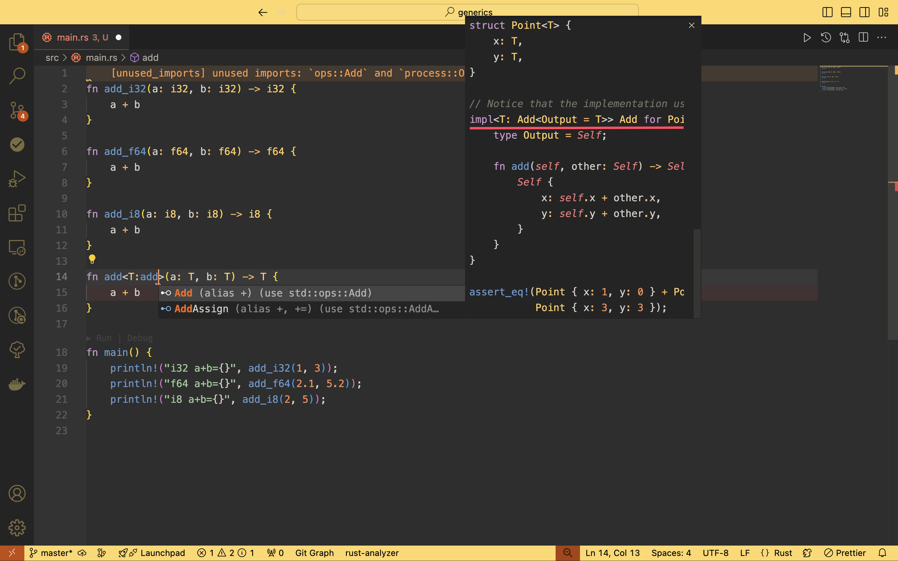
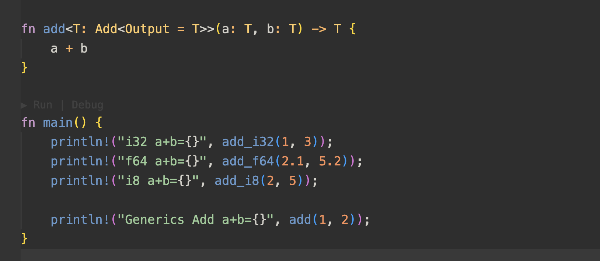
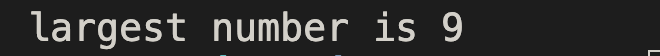
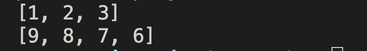

## 函数中使用泛型

泛型是实现让一个功能函数支持不同类型的手段，我们称之为多态。在不支持泛型时，我们可能会写出如下代码：

```rust
fn add_i32(a: i32, b: i32) -> i32 {
    a + b
}

fn add_f64(a: f64, b: f64) -> f64 {
    a + b
}

fn add_i8(a: i8, b: i8) -> i8 {
    a + b
}
```

上面是多个类型的 `add` 函数，因为类型的限制，我们需要为每种类型单独写一个函数。有了泛型之后，可以省去这样冗余的代码，泛型的声明格式：

使用泛型参数，有一个先决条件，必需在使用前对其进行声明。

使用前声明的意义是：**表示我这个函数拥有多少泛型参数**，如

```rust
fn add<T> // 表示当前 add 函数拥有一个泛型参数 T

fn foo<T, R> // 表示当前 foo 函数拥有两个泛型参数 T，R
```

延用 add 函数，我们完善泛型声明后如下：



我们得到了一个报错，`cannot add T to T` 因为泛型参数 T 可以是任何类型，但并不是所有类型都可以做加法这个行为，所以我们还需要对泛型参数 T 进行特征（Trait）限制，以表示这个类型是可以进行相加的。

我们输入 add 可以看到相关的特征提示，add 特征也是支持泛型的，按照提示的示例，我们修改函数声明。



`Add` 是 `use std::ops::Add` 引入的，`Add<Output = T>` 我们把泛型参数 T 传入 Trait `Add` 的泛型声明中，整个泛型的声明就完成了。



下面我们再尝试写一个复杂点的例子，实现一个输出数组中最大值的函数。

``` rust
/**
 * 1. 声明泛型参数 T
 * 2. list 为类型为 T 的数组，用指针类型让数组参数在编译时期有一个确定的大小
 * 3. 返回值为 T类型值 的引用
 */
fn largest<T: std::cmp::PartialOrd>(list: &[T]) -> &T {
    // 默认最大值为数组第一个元素
    let mut max = &list[0];
    // 遍历后续数组，逐个比较，出现更大的值则替换
    for i in 1..list.len() {
        // 这里需要注意，需要限制泛型参数 T <T: std::cmp::PartialOrd>，要拥有比较大小的特征
        if max < &list[i] {
            max = &list[i];
        }
    }

    max
}

fn main() {
    let number_list = vec![1, 5, 9, 4, 7];
    let max = largest(&number_list);
    println!("largest number is {}", max);
}
```

运行后结果如下：



## 结构体中使用泛型

基于上面泛型的理解，我们直接看声明：

```rust
struct Point<T> {
  x: T,
  y: T,
}

// 上述类型声明表示，结构体 Point 的 fields 都是同一个类型的

fn main() {
    let p1 = Point { x: 1, y: 2 };  // Point<i32>
    let p2 = Point { x: 1.0, y: 2.0 };  // Point<f64>
}
```

那么当我们需要 x, y 不同类型时，我们可以声明第 2 个泛型参数 U，如下：

```rust
struct Point<T, U> {
  x: T,
  y: U,
}

fn main() {
    let p1 = Point { x: 1, y: 2 };  // Point<i32>
    let p2 = Point { x: 1.0, y: 2.0 };  // Point<f64>
  
   // 这样既可以支持相同类型的情况，也可以支持不同类型的情况
   let p3 = Point { x: 1, y: 2.0 }; // Point<i32, f64>
}
```

## 枚举中使用泛型

```rust
enum Option<T> {
    Some(T),
    None,
}

enum Result<T, E> {
    Ok(T),
    Err(E),
}
```

## 方法中使用泛型

```rust
struct Point<T, U> {
    x: T,
    y: U,
}

// 这里 Point<T, U> 被视为一种结构体类型，所以在实现其方法时，
// 也需要通过 impl<T, U> 提前声明泛型参数列表
impl<T, U> Point<T, U> {
    fn x(&self) -> &T {
        &self.x
    }
}
```

我们再加入一个复杂点的方法 mixup，功能是传入另一个 Point，然后输出它们交叉后的新 Point。交叉指的是，取原 Point 的 x 和传入 Point 的 y，组成一个新的 Point。

```rust
impl<T, U> Point<T, U> {
    fn x(&self) -> &T {
        &self.x
    }
 
   // mixup 方法入参需要泛型参数 T2, U2
   // 所以需要提前声明泛型参数列表 mixup<T2, U2>
   // 返回值类型为交叉后的 Point<T, U2> 结构体类型
    fn mixup<T2, U2>(self, other: Point<T2, U2>) -> Point<T, U2> {
        Point {
            x: self.x,
            y: other.y,
        }
    }
}

fn main() {
    // 这里 mixup 并不需要手动传入类型，会根据入参 Point<T2, U2> 类型自动做类型推断
    let p4 = p1.mixup(Point { x: 9.0, y: "Hello" });
    println!("p4.x = {}, p4.y = {}", p4.x, p4.y);
}
```

运行结果，如下：


## const 泛型

意思是 **常量的泛型**，在诸如当我们只希望控制参数类型为一个整数 i32 数组，但数组长度不需要固定的情况可以使用，看具体例子：

```rust
// usize 表示索引类型
fn display_array<const N: usize>(list: &[i32; N]) {
    println!("{:?}", list);
}

fn main() {
    // 打印一个数组
    let a1 = [1, 2, 3];
    display_array(&a1);

    let a2 = [9, 8, 7, 6];
    display_array(&a2);
}
```

运行结果，如下：



## 泛型代码的性能

使用泛型给开发者带来了很多便利，在开发效率上无疑是提效的。而泛型代码虽然输入是一种模式，但是经由 Rust 编译器，实际会被翻译成 n 种，所有可支持的情况都会有一份代码，这个翻译的过程被称为 **单态化**，即声明时是 **多态的**，编译后即变为 **单态**。同时也就意味着，在运行时其实是不会因为泛型带来任何增加的开销的，因为编译期间都生成好了，对应的调用代码调用的也就是那一份翻译后的代码。所有的开销都是在编译期间产生的（编译时间及编译后文件大小会有所增加），运行期间无损，仍然保持高效。
