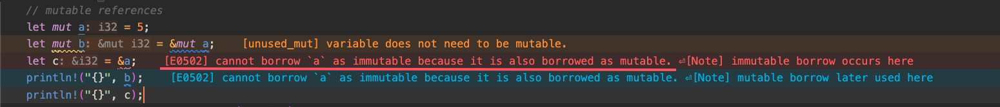
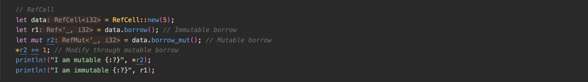
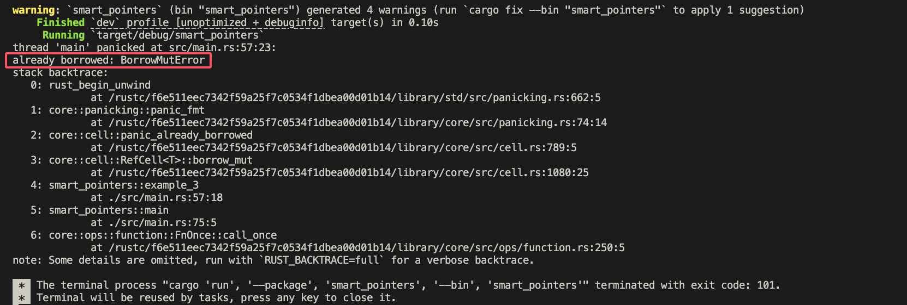
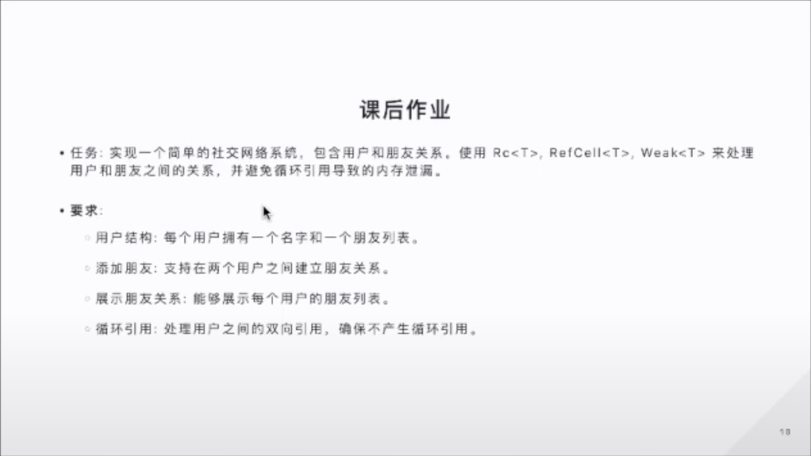
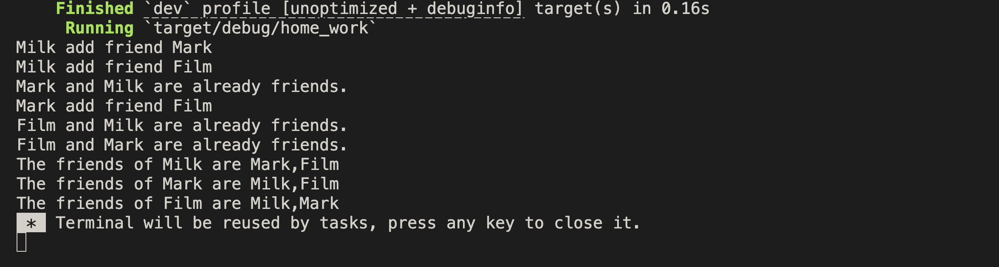

## Rc 智能指针

Rust 所有权机制要求一个值只能有一个所有者，如果出现需要共享数据的情况，也就是说一个数据资源拥有多个所有者，或者说一个资源需要被多个对象引用，Rust 设计了 `Rc` 智能指针来做相应实现。

### `Rc<T>`

`Rc` 是引用计数（Reference counting）的意思，顾名思义就是记录一个数据资源被引用的次数，以此来确定该数据是否正在被使用。当引用次数归零后，就代表该数据不再被任何使用，因此可以被清理释放。在离开某个作用域时，如引用对象被 `drop` 了那引用次数也会对应减去。

### `Rc::new`

我们使用 `Rc::new(data)` 创建一个新的 `Rc<T>` 智能指针，并赋值给某个变量。

### `Rc::clone`

我们使用 `Rc::clone(Rc<T>)` 创建出一个新的 `Rc<T>` 智能指针，指向堆内存上那个被共享的 `Rc<T>` 智能指针。使用 `clone` 可以在不转移所有权的条件下得到 `owned value`，而不是某个值的引用。

#### Owned Value

`let x = 5` 我们把 `x` 称为 variable 变量，`5` 称为 owned value 即 数据值，此时 变量 x 拥有 数据 5 的所有权。

### `Rc::strong_count`

新建的 `Rc<T>` 智能指针初始引用计数为1，每被 `clone` 一次就会相应 +1，调用 `Rc::strong(Rc<T>)` 会返回传入的 `Rc<T>` 智能指针当前被引用的次数。

## Strong Reference 强引用

`Rc` 是 strong reference 强引用，强引用指的是会参与引用计数的引用，参与引用计数意味着每被引用一次，该数据的被引用次数就会加一，只要被引用次数不为0，那这块数据对应的资源就不会被释放。

比如 c 是一个 `Rc` 变量，它被 a 和 b 引用着，那只有 a 和 b 的引用都被 drop 了之后，c 对应的内部数据资源才会被清理。这里就会出现一个问题，因为强引用会参与引用计数，它会直接影响到内存释放的逻辑，当产生循环引用时，比如 a 引用 b，c 引用 d，b 和 d 之间存在互相引用，本来 a 离开作用域后应该将 b 释放的，但是因为 d 还有对 b 的引用所以这块资源并不能释放，同样的 c 离开作用域后应该将 d 释放的，但 d 还存在被 b 引用着也无法被释放，这就会产生内存泄漏问题。为了避免内存泄漏，当我们遇到循环引用的场景时我们需要用 weak reference 弱引用来替代，下面说明一下相关用法。

## Weak Reference 弱引用

### `Rc::downgrade`

使用 `Rc::downgrade(&Rc<T>)` 得到一个 `Rc` 引用的弱引用，弱引用不参与引用计数，它只是 `Rc` 在处理循环引用上的一个解决方案。而也因为不参与引用计数，所以无法保证被引用的对象一定是存在的，当需要访问它对应的数据时，需要使用 `xx.upgrade()` 将其转换为强引用类型，且该强引用被引用的对象还存在时，才可以访问。

```rust
let t = Rc::new(String::from("Hello"));
let weak_t = Rc::downgrade(&t);

// upgrade 得到强引用的对象
match weak_t.upgrade() {
  // 若强引用对象还存在
  Some(t) => {
    println!("{}", t);
  }
  // 强引用对象不存在
  _ => {}
};

```

## 共享资源之后还安全么？

我们之前学习过，Rust 中设计所有权机制就是为了保证数据资源的使用安全，一个数据资源只有一个所有者，就能规避掉对一个数据**同时**进行读写的状况。

而也是因为所有权的限制，在很多实际场景中，会让开发者因为所有权转移的规则而头疼，导致代码总是无法编译通过、报错。于是乎，`Rc` 智能指针的诞生让开发者可以更轻松的实现对一个数据资源的共享且不违背所有权规则的底层原因 —— 数据读写安全，它提供了“创建指向同一块资源的多个指针”的能力，以及一些相关的功能（如：引用计数）。查看 `Rc` 的内部实现就可以发现，它在创建时其实是把数据装在了一个 `Box` 智能指针中（让不确定大小的数据类型变成有大小的数据类型，有大小的数据类型指的是为其在栈上申请一块空间，并在栈上拥有一个固定大小的指针指向这块内存），然后又在外面套了一层自己的壳，而在 `Rc` 智能指针这一层并没有提供**修改内部数据**的方法，所以即使是共享资源，多个对象可以访问一块内存资源，内存中的数据也还是安全的，它只是一个不可变的引用。

但是往往，需要 share data 的场景 和 修改的场景 都是伴随出现的，我们遇到 共享 + 修改 时需要配合 `RefCell` 使用。

## RefCell

一般在共享数据的场景下，如果还需要支持对原数据进行修改，我们就可以使用 `RefCell`。`RefCell` 是让你拥有对数据修改能力的结构体，即便这个数据是 `immutable` 的。它和可变引用的区别是，可变引用依然遵守一个所有者的原则，一个数据的可变引用和不可变引用是不能同时存在的。我们可以看下例子：



如报错所示，因为引用本身还是遵守 ownership 的原则，不可能同时存在两种类型的引用，这是违背数据安全的，在编译时就可以校验出来。说回 `RefCell` ，我们看到前面引用存在着严格的借用关系，当我们需要借用的地方变多时，就会很难在写代码时就整理出明确的借用关系。此时就可以用 `RefCell`，它没有编译时的借用关系校验，而是运行时校验，介绍下它的常用内容。

### `RefCell::new`

创建一个新的内部可变的 `RefCell` 结构体

```rust
use std::cell::RefCell;

let data = RefCell::new(5);
```

### `borrow()`

得到某个 `RefCell` 的不可变借用

```rust
let r1 = data.borrow();  // Immutable borrow
```

### `borrow_mut()`

得到某个 `RefCell` 的可变借用

```rust
let mut r2 = data.borrow_mut();  // Mutable borrow
*r2 += 1; // Modify through mutable borrow
```

### `RefCell` 的限制

`RefCell` 也有一个使用规则，在运行时不能同时存在着可变借用和不可变借用。

如下图的示例，我们可以看到虽然我们创建了可变借用和不可变借用，并有同时存在的时刻，但这并没有触发编译报错：



我们运行代码，可以看到报错信息 “already borrowed”：



## Interior Mutability 内部可变性

内部可变性指的是即使变量本身定义的是非可变变量，使用 `RefCell` 也能改变其内部的数据。

## 练习



实现：

```rust
use std::{
    cell::RefCell,
    rc::{Rc, Weak},
};

fn main() {
    home_work();
}

#[derive(Debug)]
struct User {
    name: String,
    // friends 用户列表 Vec<User>
    // a、b 存在互相引用 需要定义成 Weak 智能指针 Vec<Weak<User>>
    // a、b 的 friends 需要有可变性 Vec<Weak<RefCell<User>>>
    friends: RefCell<Vec<Weak<User>>>,
}

impl User {
    fn new(name: &str) -> Rc<User> {
        Rc::new(User {
            name: String::from(name),
            friends: RefCell::new(vec![]),
        })
    }
    // 因为我们需要拿到 user 内部的 friends 数据，所以此时需要用 Rc 而不是 Weak，Weak 无法得到内部数据
    fn add_friend(self: &Rc<User>, other: Rc<User>) {
        // 需要检查other和self是否已经是朋友，若不是则push进friends列表
        // 如何检查 friends 列表，已知 friends 列表是一个 Weak<User> list
        let weak_other = Rc::downgrade(&other.clone());
        let is_friend = self
            .friends
            .borrow()
            .iter()
            .any(|user| weak_other.ptr_eq(user));

        if is_friend {
            println!("{} and {} are already friends.", self.name, other.name);
            return;
        }

        if !is_friend {
            println!("{} add friend {}", self.name, other.name);
            // 若不是朋友，更新 friends 列表
            self.friends.borrow_mut().push(weak_other);
            other.friends.borrow_mut().push(Rc::downgrade(self));
        }
    }
    fn list_friends(self: &Rc<User>) {
        let mut output = String::from(format!("The friends of {} are ", self.name).as_str());
        for item in self.friends.borrow().iter() {
            match item.upgrade() {
                Some(friend) => output.push_str(format!("{},", friend.name).as_str()),
                None => {}
            }
        }
        output.pop();
        println!("{}", output);
    }
}

/**
 * 实现一个简单的社交网络系统，包含用户和朋友的关系。
 * 用户结构：每个用户拥有一个名字和一个朋友列表
 * 添加朋友：支持在两个用户之间建立朋友关系
 * 展示朋友关系：能够展示每个用户的朋友列表
 * 循环引用：处理用户之间的双向引用，确保不产生循环引用
 */
fn home_work() {
    let a = User::new("Milk");
    let b = User::new("Mark");
    let c = User::new("Film");

    a.add_friend(b.clone());
    a.add_friend(c.clone());
    b.add_friend(a.clone());
    b.add_friend(c.clone());
    c.add_friend(a.clone());
    c.add_friend(b.clone());
    a.list_friends();
    b.list_friends();
    c.list_friends();

    // println!("a = {:?}", a);
    // println!("b = {:?}", b);
    // println!("c = {:?}", c);
    // println!("a rc = {:?}", Rc::strong_count(&a));
    // println!("b rc = {:?}", Rc::strong_count(&b));
    // println!("c rc = {:?}", Rc::strong_count(&c));
}

```

运行结果：


