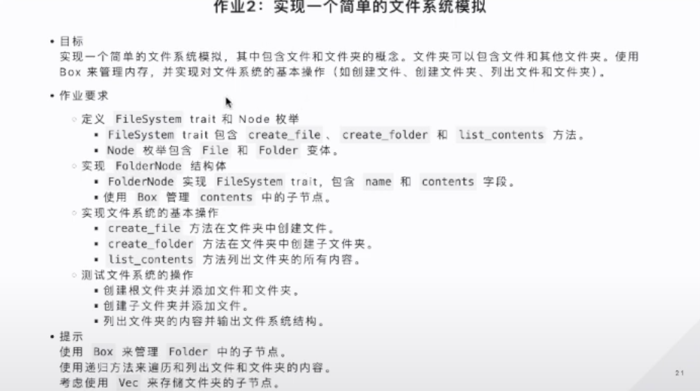
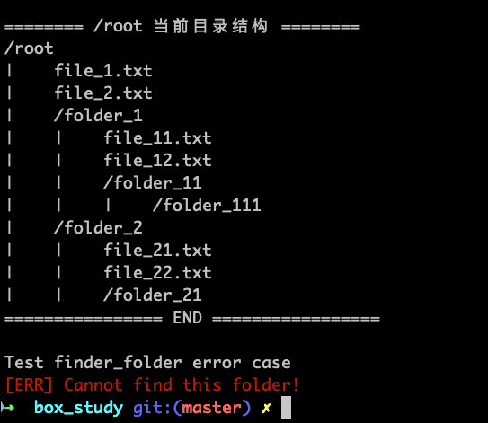

首先理解，指针是什么？指针是一个存储了内存地址（memory address）的变量，该内存地址引用或者指向了内存中另外的数据。

在 Rust 中最常见的指针就是引用（reference），引用变量向被它引用的变量借用（borrow）它指向的数据，这意味着它们自身是没有对该数据的所有权（ownership）的。

引用只包含一个指向被引用变量的指针，除此之外，引用就再无其他功能了。而 Rust 是静态编译语言，在编译期间就需要确定变量数据的大小以及何时释放。所以设计了智能指针，在普通指针的基础上，还包含了当前长度（len）、最大长度（capacity）等字段，这些都是用来确定指针类型指向的那块数据所需的内存 size 的字段。像是我们之前用过的 `String` 、`Vec` 都是智能指针数据类型。

不同于普通指针，智能指针是具有所有权的指针，且实现了 Deref（解引用）和 Drop（清理）两个 trait（特征），这使得他们可以像指针一样解引用并在离开作用域是自动清理资源。这是对智能指针是什么的一个大致概括，具体功能可以通过后面更多的实际例子去理解更为自然。

### 为什么存在智能指针？

#### 性能管理 — 处理大体量的数据

栈是我们用于快速读写的内存空间，并不适合存储过大的数据。相对来说，简单的数据类型会被分配在栈上，但针对简单却大体量数据，我们就不应该再继续存储在栈上了，栈溢出会引起程序的崩溃。

```rust
/*
大体量数据，长度为 1_000_000 的数组，数组默认是分配的栈内存
*/
let arr_stack = [0; 1000000];
for i in arr_stack {
  println!("{}", i);
}
```

运行代码，我们会得到如下报错：


正如前面所说 —— 栈溢出，程序中止运行了。

#### 处理更复杂的数据结构

Rust 是静态编译语言，这意味着它在编译时期就是需要知道每个数据所需内存大小，而针对一些复杂的数据结构，如递归结构、分享结构【❓TODO 这是啥】等，是没有固定大小的，而智能指针就是为了解决这一问题设计的。

举个例子，常规 `enum` ，因为一次只会使用 `enum` 的某一个值，所以该 `enum` 的所需内存大小取决于其下面内存占用最大的一个枚举值。

```rust
enum Message {
  Quit,
  Move { x: i32, y: i32 },
  Write(String),
  ChangeColor(i32, i32, i32),
}

// enum Message 中所需内存最大的是 ChangeColor，
// 则该 enum 所需内存为 ChangeColor 所需的内存大小
let a = Message::Quit;
```

更复杂的数据结构，递归 `enum` 类型

```rust
enum List {
  Cons(i32, List), // 动态大小，无法确定 size
  Nil,
}
```

对于递归 `enum` 来说，基于我们前面计算 `enum` 大小的方式，会发现我们并不能知道哪个是内存大小最大的枚举值，递归的枚举值是动态的，所以我们无法得出递归类型的数据大小。

#### 【TODO】在普通指针基础上，完善更多的功能

❓TODO：所有权、悬垂指针、动态大小？

#### 【TODO】RC 智能指针

智能指针是 Rust 确保其安全性的一种方式。智能指针是一种包裹了数据和提供了一些额外功能的数据结构，例如所有权（ownership）和引用计数（reference counting）。Rust 设计了多种智能指针的数据类型，适用于多种不同的场景。

### Box Smart Pointer

Box 智能指针是 Rust 中智能指针的一种，它是在栈上拥有固定大小的指针，但其指向的数据，在堆上可以是任意大小的数据。所以当我们使用了 Box 智能指针，我们是可以在编译时就知道所需内存大小的。因此上面说到的编译时无法计算内存大小的问题，便就迎刃而解了。

我们将改写上面递归 `enum` 的例子，用 Box 智能指针来解决问题：

```rust
// 将递归嵌套的 List 类型改写成 Box<List> 智能指针类型
// 智能指针在栈侧是拥有固定大小的指针，可以顺利通过编译
enum List {
  Cons(i32, Box<List>),
  Nil,
}

use List::{ Cons, Nil };

fn main() {
  // Box::new() 创建 Box 智能指针类型变量
  let list = Cons(1, Box::new(Cons(2, Box::new(3, Box::new(Nil)))));
}
```

智能指针之所以功能强大，还因为 Rust 为其实现了两种特征（trait），Deref Trait 和 Drop Trait，让我们一起了解下。

### The Deref Trait

Deref Trait 解引用是为了让智能指针能像普通指针一样使用而实现的特征（trait）。这句话有两个关键点：

1. 什么是 trait（特征）？

2. 什么叫像普通指针一样使用？

我们逐一了解一下：）

#### Traits 特征

 特征（traits）是 Rust 设计出可以让不同类型拥有相同行为（behavior）的一种实现，在描述某种或者说某类行为时可以包含1个或者多个方法（methods），即特征就是我们用来使得不同类型能够共享（sharing）同一批方法的手段。

我们看一下 trait 的例子：

```rust
pub trait TraitA {
  fn method_A(&self) -> String;
  fn method_B(&self) -> String {
    String::from("Hello")
  };
}
```

一般我们描述 trait 时，会包含一个或多个方法的签名，如果对方法写了具体实现，则作为该方法的默认行为。我们也可以在具体类型上重写（overwrite）特征下的方法，来自定义不同类型上的实现。

``` rust
struct StructA {
    name: String,
}

// once impl A for B means B is shared with all methods in A
impl TraitA for StructA {
    // overwrite method_A of trait TraitA
    fn method_a(&self) -> String {
        String::from(["I'm", &self.name].join(" "))
    }
}

fn main() {
  let a = StructA {
    name: String::from("aaa"),
  };
  
  // call the methods of trait
  let name = a.method_a();
  println!("{}", name);
  
  a.method_b(); 
}
```

Rust 定义很多内置的特征，并为我们提供了 `derive` 属性，用于在一个 struct 或 enum 上生成对某个 trait 的实现的相关代码，这里的代码就是将该 trait 所拥有的默认实现复制过来。这样我们就能快速的拥有一个 trait 的所有默认行为，内置的特征需要通过 `use xxx` 导入之后使用。

#### 像普通指针一样使用

其实指的就是，可以对于指针变量使用 `*` 操作符，我们知道因为所有权的关系，我们只能对指针类型的变量进行借用：

```rust
let x = String::from("Hello"); // String
let y = &x; // &String
println!("Are {} and {} equals? {}", x, y, x == y); // ❌ [ERROR] can't compare `String` with `&String`.
```

这里编译会报错，因为第 3 行无法将不同类型的两个值进行比较，x 是 String 类型，而 y 是 a reference to String。

y 就是借用了 x，借用就意味着其实就只是拿到了一个内存地址，那么当我们需要直接使用数据时（如：上面做比较的场景 x == y）就需要用 `*` 操作符做解引用，拿到内存地址对应的数据：

```rust
let x = String::from("Hello"); // String
let y = &x; // &String
println!("Are {} and {} equals? {}", x, y, x == *y); // ✅
```

除了 `*` 操作符实现了 deref，还有包括我们经常使用的 `.` 操作符，是默认带有解引用功能的，通过例子看一下：


可以看到，当我们在使用 `.` 操作符时，会得到自动解引用之后的结果（倒数第 2 行），并且最后一行我们看到，无论是多加了多少层的引用，都能得到最终指向的那块数据。这就是 `.` 操作符上带有的魔法之一 —— 自动解引用。

为了更好的理解解引用特征，我们手动还原一个自己的 `MyBox` 智能指针类型。

#### 手动还原 Box 智能指针

首先，`MyBox` 是一个结构体，它只有一个字段 —— 被他包裹的类型，且不需要字段名，即我们采用**元组结构体**（tuple struct）构造 `MyBox`。这里还需要使用泛型 `T`，被包裹的类型是由调用的时候传入的。

> 这一部分需要补充泛型（generics）的内容，可以参考 <https://course.rs/basic/trait/generic.html>

使用泛型的规范是，先声明 `xxx<T>` 后使用 `structNameXXX(T)、functionNameXXX(x: T)` 等。

```rust
struct MyBox<T>(T);
```

接着实现 `new` 方法，在 Rust 中使用 `impl` 来定义方法，如 `impl Circle` ，泛型用 `impl<T> Circle<T>` 。

``` rust
impl<T> MyBox<T> {
    fn new(x: T) -> MyBox<T> {
        MyBox(x)
    }
}
```

下一步，在 `MyBox` 上实现 `deref trait` ，可以参考官网 `Deref Trait` 给出的示例实现：


```rust
impl<T> Deref for MyBox<T> {
    type Target = T;

    fn deref(&self) -> &Self::Target { // Target 就是目标类型 T
        &self.0 // 因为 MyBox 是元组结构体，对应的值 self.0
    }  // 注意：解引用并不会涉及所有权转移，返回的值还是一个引用值
}
```

现在我们就可以在 MyBox 类型变量上使用解引用功能了，让我们试下:

```rust
fn main() {
    let n = MyBox::new(String::from("Marnie"));
    println!("{:?}", n);

    let a = String::from("Marnie");
    println!("Are {} and {} equals? {}", a, *n, a == *n);
}
```


以上就是模拟 MyBox 并实现 Deref Trait 的大致过程，当我们使用 `*v` 时，就会去 `v` 对应的类型 `T` 上找 `deref` 方法，即 `*(v.deref())`，所以但凡是实现了 `Deref Trait` 的类型变量都可以使用 `*` 操作符来解引用。

在官网关于"使用 Deref Trait 将智能指针像常规引用一样对待"有很详细的介绍，细节可以更多的参考 <https://doc.rust-lang.org/book/ch15-02-deref.html#treating-smart-pointers-like-regular-references-with-the-deref-trait>，这里再提一点比较重要的内容：

#### Implicit Deref Coerions 隐式的强制解引用

在 Deref Trait 相关内容下，有一个知识点叫 Deref coerion 强制解引用，意思是在某些场景下，Rust 会自动发生解引用。

这里会发生自动解引用的场景是在变量作为参数传入方法 methods 或者函数 functions 时，若传入变量类型实现了 Deref Trait，变会发生自动解引用的行为。我们分析看下官方的例子：

```rust
fn hello(name: &str) {
    println!("Hello, {}!", name);
}
```

这里写了一个 `hello` 函数，接收 string slice 类型的参数，如果我们继续用前面 `MyBox` 的实例 `n` 传入 `hello` 函数 `hello(&n)`，如：

```rust
fn main() {
    let n = MyBox::new(String::from("Marnie")); // MyBox<String>
    println!("{:?}", n);

    hello(&n); // 🤔...
}
```

我们会发现，编辑器并没有提示任何编译错误，这里就是强制解引用的作用。

首先，我们传入的 `n` 本身是个 `MyBox<String>` 类型，按照强制解引用的发生规则 —— 当我们将某个类型作为参数传入函数或者方法时，会自动发生解引用。`MyBox`类型的解引用实现我们前面已经还原了，那么这一步强制解引用就相当于调用 `n.deref()`，则 `&n` 从 `&MyBox<String>` -> `&String`，这么看起来还是不对呀，目标参数接收的是 `String Slice`，现在还只是 `String`。好，这里注意 📢，当类型上实现了 Deref Trait 的话强制解引用会一直继续自动发生，即可能发生连续的解引用。

我们上一步强制解引用得到的是类型 `String`，在标准库里 `String` 也对应实现了 `Deref Trait` ，所以会再次做强制解引用，我们可以查看官网看到标准库中对于 `String` 上 `Deref Trait` 实现的签名描述：


可以看到 `String` 的 `deref` 方法返回 `string slice` 类型，所以才满足了 `hello` 函数，并不会有编译问题。

关于这个连续强制解引用，我尝试再用一些自定义的类型例子来验证一下是否如此：

```rust
use std::ops::Deref;

struct TypeA(i32); // i32
struct TypeB(TypeA); // TypeA
struct TypeC(TypeB); // TypeB

impl Deref for TypeA {
    type Target = i32;
    fn deref(&self) -> &Self::Target {
        println!("calling TypeA's deref");
        &self.0
    }
}

impl Deref for TypeB {
    type Target = TypeA;
    fn deref(&self) -> &Self::Target {
        println!("calling TypeB's deref");
        &self.0
    }
}

impl Deref for TypeC {
    type Target = TypeB;
    fn deref(&self) -> &Self::Target {
        println!("calling TypeC's deref");
        &self.0
    }
}

fn test(x: &i32) {
    println!("I get {}", x);
}

fn main() {
  let a = TypeA(0);
  let b = TypeB(a);
  let c = TypeC(b);
  
  test(&c);
}
```

我写了上述的这些代码，企图验证是否会有连续的强制解引用发生。按照我上个段落的结论，我预想的 将 `c` 作为参数传入 `test` 函数，`c` 的类型 `TypeC` 上又有 `deref trait` 的实现，那么连续的强制解引用将会是 `TypeC -> TypeB, TypeC -> TypeA, TypeA -> i32`，我们可以看到编译器首先并没有提示类型错误，我们再运行看看：


如结果所示，印证了预想，那么这就是一个连续的强制解引用的过程。Rust 之所依提供这个隐含的功能就是为了让我们省去手动做"连续的类型转换"的过程。我们再强调一下，这个强制类型转换发生需要符合的条件：

1. `&T -> &U ===> T: Deref<Target=U>`  T 上有返回类型为 U 的解引用实现
2. `&mut T -> &mut U ===> T: DerefMut<Target=U>`  T 上有返回类型为 U 的可变解引用实现
3. `&mut T -> &U ===> T: Deref<Target=U>` T 上有返回类型为 U 的解引用实现（可变的类型可以转换为不可变类型，但不可变不能转换成可变）

### The Drop Trait

除了 Deref Trait 外，智能指针还拥有 Drop Trait。Drop Trait 是 Rust 设计用于内存管理的特征，当一个变量超出 scope 之后，自动释放其占用的内存。Drop Trait 的实现和 Deref Trait 异曲同工，本质也是执行该 Trait 下对应的 `drop method` , 当我们需要自定义释放内存的场景就可以手动实现 `drop method` ，让我们一样用例子看一下：

```rust
use std::ops::Drop;

#[derive(Debug)]
struct CustomSmartPointer {
    data: String,
}

impl Drop for CustomSmartPointer {
    fn drop(&mut self) {
        println!("CustomSmartPointer of data {} is dropping...", self.data);
    }
}

fn main() {
    let c1 = CustomSmartPointer {
        data: String::from("c1"),
    };
    println!("{:?} is created.", c1);
    let c2 = CustomSmartPointer {
        data: String::from("c2"),
    };
    println!("{:?} is created.", c2);
}
```

运行结果如下：


结合所有权系统，当一个变量离开作用域以及不存在对其的任何引用，Rust 会自动释放变量占用的内存，这样就无需开发者手动管理内存。我们上面的代码就可以看到这个效果，内存释放是按照变量出栈顺序，即先进后出，创建顺序是 `c1 -> c2`，销毁顺序则是 `c2 -> c1`，如打印结果所示。

这里有一点需要注意，因为 Rust 已经有一套合理管理内存的机制 —— 离开作用域内存会自动被释放，所以是不支持我们直接手动调用 `xxx.drop()` 来释放内存的，这样会导致双重释放内存的错误（a double free error）。

### Trait Objects

虽然 Rust 强调静态类型编译，需要有明确的数据类型，但为了实现代码的多态性，Rust 也提供了一种方案可以动态调度（dynamic dispatch）类型，它就是 `Trait Objects`。首先我们理解一下什么是动态调度：

#### Dynamic dispatch 动态调度

动态调度表示在编译时并不知道具体类型，而是在运行时才能确定类型。它与 static dispatch 相对，static dispatch 静态调度是指在编译时就已经确定了类型，一般我们没有特别处理的都属于静态调度，变量的类型是明确的，函数的入参类型也是确定的，所有的类型都是编译时就已经固定了的。而动态调度需要使用关键字 `dyn` ，来表示这是一个动态调度类型，我们需要结合 `Trait Objects` 这个概念一起使用。

`Trait Objects` 是 Rust 提供应对有着同样行为的但所属不同类型的变量的事务，用官方的例子，比如我们现在要实现一个前端框架库，我们会拥有很多 `components` 组件，每个组件都是一个类型。

因为组件会有很多种，比如 Button、Select、Input，我们在声明 components 类型的时候，首先它是个可以更改长度的 list，所以 `components: vec![???]`，好了，这里就有一个问题出现了！`vec!` 里面的类型并不是我们以往固定的某一种类型，它可能是 `Button/Input/Select` 等等，这种情况我们就需要使用动态调度，表示这里的类型不是某一个固定类型，是多种类型。

具体使用方式，用 `dyn` 关键字表示这里是动态调度，`dyn` 后面跟的类型是一个 `trait`，`dyn xxxTrait` 则表示当前是一个 `trait objects` 类型。trait（特征）我们在上面有单独介绍，它用来描述某种行为，那么 `trait objects` 其实就是拥有同种行为的不同类型的对象，本质就是不同类型都对同一个 trait 进行了实现。我们上面这个组件的例子，就是 `Trait Objects` 的一个标准案例，组件本身都是不同的类型，但是它们都至少有某个或某些相同的行为，比如绘制功能，那么实现时就可以把绘制作为一个 trait，这些组件都有对于 绘制trait 的实现，这些组件便可以通过 `dyn Draw` 视为同一个 `trait object` 类型。但因为 `trait` 本身没有固定大小，所以它必须结合指针类型使用（指针类型拥有固定大小），如 `Box<dyn Draw>` 表示 `Draw trait objects` 类型。

用这个场景，我们具体实现下代码来理解：

```rust
// 绘制trait
trait Draw {
  fn draw(&self);
}

// Button类型
struct Button {
  width: u32,
  height: u32,
  label: String,
}

// Select类型
struct Select {
  width: u32,
  height: u32,
  options: Vec<String>,
}

// 都会继承绘制trait
impl Draw for Button {
  fn draw(&self) {
    // do Button's drawing stuff 
  }
}

// 都会继承绘制trait
impl Draw for Select {
  fn draw(&self) {
    // do Select's drawing stuff 
  }
}

// 框架库类
struct Library {
  // components list
  components: Vec<Box<dyn Draw>>, // a list of "Draw trait objects"
}
```

这就是【动态调度 + trait objects】的使用方法，这种方式本质上其实是让我们有了可以同时使用不同的类型的能力，这就是动态调度的魔法。和泛型（generics）的不同之处就是这里，泛型只是声明时的多态，在调用时一次传入的还只是同一个类型，而动态调度是一次调用能传入多种类型，实现了真正的运行时多态。

## 练习

### 作业2



### 实现

```rust
use std::ops::DerefMut;

use colored::Colorize;

fn main() {
    trait FileSystem {
        // type Output;
        fn create_file(&mut self, name: &str) -> &Node;
        fn create_folder(&mut self, name: &str) -> &Node;
        fn list_contents(&self);
        fn find_folder(&mut self, name: &str) -> Option<&mut Self>;
    }

    #[derive(Debug)]
    enum Node {
        // 文件
        File(String),
        // 文件夹
        Folder(FolderNode),
    }

    #[derive(Debug)]
    struct FolderNode {
        name: String,
        contents: Vec<Box<Node>>,
    }

    impl FileSystem for FolderNode {
        // 在当前文件夹下创建单个文件
        fn create_file(&mut self, name: &str) -> &Node {
            self.contents.push(Box::new(Node::File(String::from(name))));
            println!("/{} 添加文件 {}", self.name, name);
            self.contents.last().unwrap()
        }
        // 在当前文件夹下创建文件夹
        fn create_folder(&mut self, name: &str) -> &Node {
            self.contents.push(Box::new(Node::Folder(FolderNode {
                name: String::from(name),
                contents: vec![],
            })));
            println!("/{} 添加文件夹 {}", self.name, name);
            self.contents.last().unwrap()
        }
        // 返回值是一个可变的 FolderNode，因为可能需要继续修改 folder 内容
        fn find_folder(&mut self, target_name: &str) -> Option<&mut FolderNode> {
            // 声明返回值为可变的，初始为 None
            let mut target: Option<&mut FolderNode> = None;

            // 遍历子目录，iter_mut() 允许返回可变的遍历对象
            for node in self.contents.iter_mut() {
                // deref_mut() 允许返回解引用后并可变的值
                match node.deref_mut() {
                    Node::Folder(folder) => {
                        if folder.name == target_name {
                            target = Some(folder);
                            break;
                        }
                    }
                    _ => {
                        continue;
                    }
                }
            }
            // log error
            if target.is_none() {
                println!("{}", "[ERR] Cannot find this folder!".red());
            }

            target
        }
        // 列出文件夹下所有文件和文件夹（递归 recursion）
        fn list_contents(&self) {
            println!("======== /{} 当前目录结构 ========", self.name);
            // print current folder name
            println!("/{}", self.name);

            // 打印单个 node 下的内容，因为需要打印目录结构，子目录需要使用递归
            fn print_node(level: usize, node: &Node) {
                // 除 root 外（非根目录），目录结构前缀逐级添加 '|[][][][]'
                let mut level_prefix = String::with_capacity(5 * level);
                // level > 1 need append space prefix
                for _ in 1..(level) {
                    level_prefix.push_str("|    ");
                }

                match node {
                    // 当前 node 是文件，没有子目录
                    Node::File(file_name) => {
                        // print current file name
                        println!("{}{}", level_prefix, file_name);
                    }
                    // 当前 node 是文件夹，子目录需要继续调用 print_node
                    Node::Folder(folder) => {
                        // print current folder name
                        println!("{}/{}", level_prefix, folder.name);
                        folder
                            .contents
                            .iter()
                            .for_each(|n| print_node(level + 1, n));
                    }
                };
            }

            match self.contents.len() {
                // 空文件夹
                0 => {
                    return;
                }
                // 当前为有内容的文件夹
                _ => {
                    for (_, content) in self.contents.iter().enumerate() {
                        // 当前文件夹 level 1，子文件夹 initial level = 2
                        print_node(2, &content);
                    }
                }
            }
            println!("================ END =================");
            println!();
        }
    }

    let mut root = FolderNode {
        name: String::from("root"),
        contents: Vec::new(),
    };

    // base on root
    {
        root.create_file("file_1.txt");
        root.create_file("file_2.txt");
        root.create_folder("folder_1");
        root.create_folder("folder_2");
        root.list_contents();
    }

    // base on root/folder_1
    {
        let folder_1 = root.find_folder("folder_1").unwrap();
        folder_1.create_file("file_11.txt");
        folder_1.create_file("file_12.txt");
        folder_1.create_folder("folder_11");
        folder_1.list_contents();
        let folder_11 = folder_1.find_folder("folder_11").unwrap();
        folder_11.create_folder("folder_111");
        folder_11.list_contents();
    }

    // base on root/folder_2
    {
        let folder_2 = root.find_folder("folder_2").unwrap();
        folder_2.create_file("file_21.txt");
        folder_2.create_file("file_22.txt");
        folder_2.create_folder("folder_21");
        folder_2.list_contents();
    }

    root.list_contents();

    {
        println!("Test finder_folder error case");
        root.find_folder("not_exist");
    }
}
```

### 运行结果


