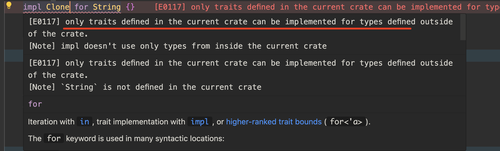
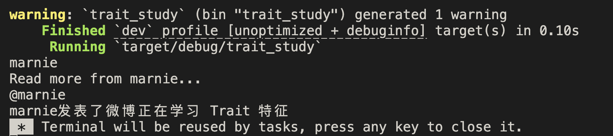
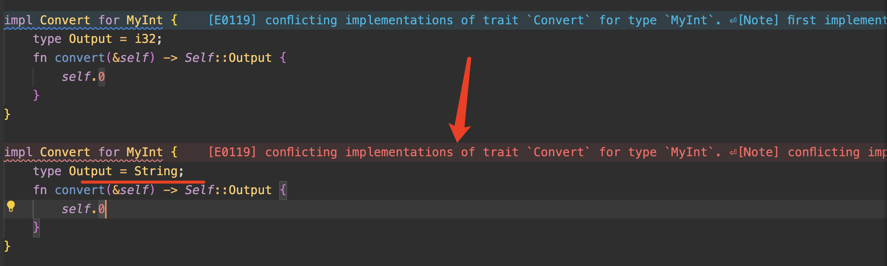
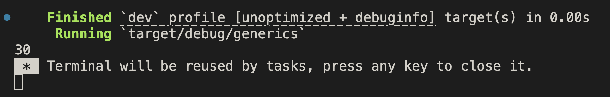
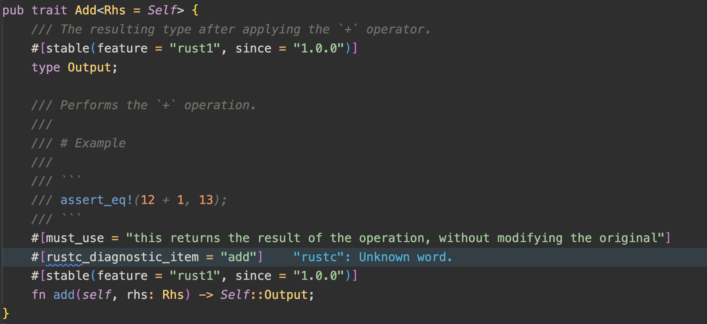
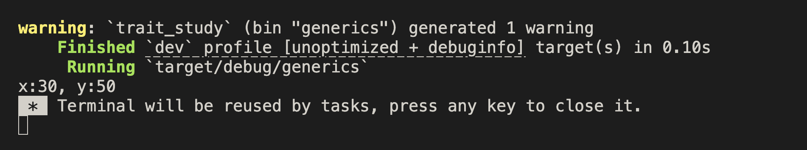
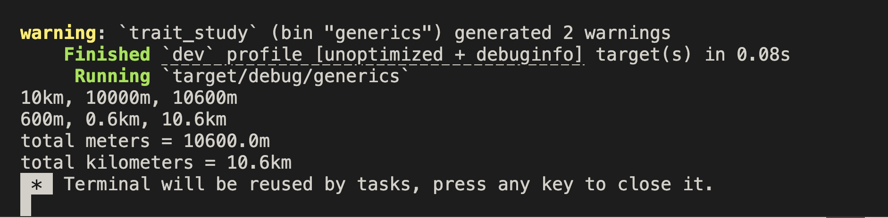
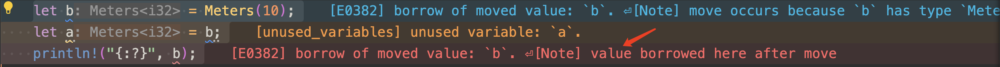
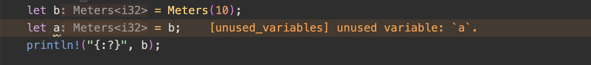

### 孤儿规则

`impl T for A` : 为 `A` 实现特征 `T` , 那么 `A` 或者 `T` 至少有一个是在当前作用域中定义的。

```rust
fn main {
  // ❌ Clone 和 String 都是标准库中定义的，而不是当前 crate 中定义的，无法使用 impl 关键字
  impl Clone for String {}
}
```



### 签名 signature 和重载 override

trait 中，可以只定义签名，也可以定义方法的默认行为。在具体实现中定义的方法会重载特征中默认的方法。

当我们在调用某个方法时，会先找自身结构体中是否有对应实现，若没有则向上🔼找特征中的该方法。

```rust
// Post 结构体
struct Post {
    name: String,
    author: String,
}

// Weibo 结构体
struct Weibo {
    username: String,
    content: String,
}

// Summary 特征
trait Summary {
    fn summarize_author(&self) -> String;
    fn summarize(&self) -> String {
        format!("Read more from {}...", self.summarize_author())
    }
}

// 为 Post 实现 Summary 特征
impl Summary for Post {
    fn summarize_author(&self) -> String {
        self.author.clone()
    }
    // fn summarize(&self) -> String {
    //     format!("文章{}，作者是{}", self.name, self.author)
    // }
}

// 为 Weibo 实现 Summary 特征
impl Summary for Weibo {
    fn summarize_author(&self) -> String {
        format!("@{}", self.username)
    }
    fn summarize(&self) -> String {
        format!("{}发表了微博{}", self.username, self.content)
    }
}

fn main() {
    let post = Post {
        name: "trait_study".to_string(),
        author: "marnie".to_string(),
    };

   // Post 中只有 summarize_author 这一个方法的实现
   // 所以当调用 summarize 方法时会找到其原特征中的对应方法
    println!("{}", post.summarize_author());
    println!("{}", post.summarize());

    let weibo = Weibo {
        username: String::from("marnie"),
        content: String::from("正在学习 Trait 特征"),
    };

   // 因为 Weibo 中分别对以下两个方法进行了重写，会覆盖特征中的默认方法
    println!("{}", weibo.summarize_author());
    println!("{}", weibo.summarize());
}

```



### 泛型的使用

#### 在特征中使用泛型：`trait AAA<T>` 使用到传入的泛型的地方，必须手动标注类型

特征接收的泛型是给**特征方法**所使用的，在具体实现了特征的结构体调用方法时，需要手动的标注泛型的实际类型，让编译器知道调用哪个类型实现的方法

```rust
// 特征 Convert 用于转换类型
trait Convert<T> {
    fn convert(&self) -> T;
}

// 我们定义一个结构体来实现 Convert 特征
// 元组结构体（tuple）
struct MyInt(i32);

// 对 MyInt 实现了两种类型的特征
impl Convert<i32> for MyInt {
    fn convert(&self) -> i32 {
        self.0 as i32
    }
}

impl Convert<String> for MyInt {
    fn convert(&self) -> String {
        self.0.to_string()
    }
}

fn main() {
    let my_int = MyInt(5);
    // 必须手动加上类型标注
    let output: i32 = my_int.convert();
    println!("{}", output);
    // 必须手动加上类型标注
    let output: String = my_int.convert();
    println!("{}", output);
}


```

#### 在方法中使用泛型：`impl<T> AAA for BBB ==> impl<T> for BBB`

在方法中使用泛型指的是 —— 当我们某个特征方法需要使用泛型，它本质上就是将指定类型传给方法，和特征、和结构体其实无关，使用上和在结构体中使用泛型是一个方式。

一种更疯狂的用法，该泛型既是方法需要用的也是特征要用的，会是下面定义的样子：

```rust
impl<T> Convert<T> for MyInt {
 // ...
}
```

当 trait 中加入了泛型，让我们拥有了针对不同场景进行不同类型实现的能力。但如果我们想控制 —— 特征的实现是可以支持多种类型的，但只能有一种类型的具体实现，这个时候泛型就做不了这样的约束了，Rust 针对需要这种约束的场景提供了一个新的方式 —— 关联类型。

#### 关联类型

关联类型是在签名时不固定类型，在实现中指定需关联的类型，且不能有多次指定（即多种实现），编译器会在第一次以后得实现上报错。

```diff

- trait Convert<T> {
-     fn convert(&self) -> T;
- }

+ trait Convert {
+     // 这是关联类型 Output
+     type Output;
+     // Self::Output 使用关联类型
+     fn convert(&self) -> Self::Output;
+ }

struct MyInt(i32);

- impl Convert<i32> for MyInt {
-     fn convert(&self) -> i32 {
-         self.0 as i32
-     }
- }

- impl Convert<String> for MyInt {
-     fn convert(&self) -> String {
-         self.0.to_string()
-     }
- }

+ impl Convert for MyInt {
+     type Output = i32;
+     fn convert(&self) -> Self::Output {
+         self.0
+     }
+ }

```

如果关联了不止一个类型，就会得到下面的报错：



#### Trait 关联类型的默认类型：`A<B = T>` T 为 A 关联类型 B 的默认类型

我们先实现一个简单的 `add` 函数，功能是将两个参数相加，并返回结果：

```rust
use std::ops::Add;

// 作用：将两参数相加，并返回结果
fn add<T: Add<Output = T>>(a: T, b: T) -> T {
  a + b
}

fn main() {
  let sum = add(10, 20);
  println!("{}", sum);
}
```



这里用了一个内部特征 `Add`，它支持泛型且默认值为 `Self`，`Self` 指的是当你没有指定传入类型时它就默认为你**正在调用的实现了 `Add` 特征的当前类型**。



```rust
// 举个例子
struct Point {
  x: i32,
  y: i32,
}

// ✨ 并没有指定 Add 的泛型，Self 则为当前类型 Point
impl Add for Point {
  // ✨ 关联类型没有默认值，必须手动指定
  type Output = Point;
  
  fn add(self, rhs: Self) -> Self::Output {
    Point {
      x: self.x + rhs.x,
      y: self.y + rhs.y,
    }
  }
}

let p1 = Point { x: 10, y: 20 };
let p2 = Point { x: 20, y: 30 };
let p3 = p1.add(p2);
```



再回到前面我们手动实现的 `add` 函数，我们再用不同类型来试验一下泛型：

```rust

    // Add 特征在 Meters 上的多态实现
    impl Add<Kilometers> for Meters {
        type Output = Meters;

        fn add(self, rhs: Kilometers) -> Self::Output {
            println!(
                "{}km, {}m, {}m",
                rhs.0,
                rhs.0 * 1000 as f64,
                self.0 + (rhs.0 * 1000 as f64)
            );
            Meters(self.0 + (rhs.0 * 1000 as f64))
        }
    }

    // Add 特征在 Meters 上的多态实现
    impl Add for Meters {
        type Output = Meters;

        fn add(self, rhs: Meters) -> Self::Output {
            Meters(self.0 + rhs.0)
        }
    }

    // Add 特征在 Kilometers 上的多态实现
    impl Add<Meters> for Kilometers {
        type Output = Kilometers;

        fn add(self, rhs: Meters) -> Self::Output {
            println!(
                "{}m, {}km, {}km",
                rhs.0,
                rhs.0 / 1000 as f64,
                self.0 + (rhs.0 / 1000 as f64)
            );
            Kilometers(self.0 + rhs.0 / 1000 as f64)
        }
    }

    // Add 特征在 Kilometers 上的多态实现
    impl Add for Kilometers {
        type Output = Kilometers;

        fn add(self, rhs: Self) -> Self::Output {
            Kilometers(self.0 + rhs.0)
        }
    }

    let m = Meters(600 as f64);
    let km = Kilometers(10 as f64);
    let total_m = m.clone().add(km.clone());
    let total_km = km.add(m.clone());
    println!("total meters = {:?}m", total_m.0);
    println!("total kilometers = {:?}km", total_km.0);

```



#### 当 Trait 作为参数传递时，如何进行类型声明 —— Trait Bound 特征约束

假设当前有一个特征 `Summary`

```rust
trait Summary {
  fn summarize(&self) -> String;
}

// TODO：实现 notify 函数，用于实现了 Summary 特征的类型进行通知（调用 .summarize 方法）
```

**`<T: U>`** 用于约束泛型 T 必须是实现了 U 特性的类型，但该函数只能接受一种泛型的具体类型

```rust
// 单个参数
fn notify<T: Summary>(item: &T) {
  item.summarize();
}

// 多参数
fn notify<T: Summary>(item1: &T, item2: &T) {
  item.summarize();
}

// 省略 Weibo，Post 定义，它们均是实现了 Summary 特征的结构体
// 只能传入一种类型
notify(Weibo {}, Weibo {}); // ✅
notify(Weibo {}, Post {}); // ❌
```

**`impl T`** 用于表示实现了 `T` 特性的类型，比起 `<T: U>` 更灵活，可以传入不同的实现了同一特征的类型

```rust
fn notify(item: &impl Summary) {
  item.summarize();
}

// 返回类型同样也能使用
fn foo() -> impl Summary {
  // ...
}

// 多参数
fn notify(item1: &impl Summary, item2: &impl Summary) {
  item.summarize();
}

// 省略 Weibo，Post 定义，它们均是实现了 Summary 特征的结构体
// 可以传入多个类型
notify(Weibo {}, Post {});
```

##### **多重约束** `<T: A + B>` / `impl A + B` 表示同时实现了 特征A 和 特征B 的类型

##### where 语法糖

当约束复杂时，可以使用 `where` 语法糖在函数后面写类型约束

```rust
fn notify2<T, U>(item1: T, item2: U)
where
  T: Summary + Display,
  U: Summary + Display + Debug,
{
  // ...
}
```

#### derive 派生特性

当一个类型没有实现某个 trait 但又想使用该特性的方法，可以使用 **`#[derive(AAA)]`** 派生特性的语法，会自动实现该特征和继承其方法的默认行为。如果一个结构体派生了某个特征，那么该结构体的每个字段都需要实现了这个特征，不然无法对齐特征，使用其功能。

##### Copy Trait 复制特征

这里介绍一个常用特征 `Copy` ，通常我们使用 `let b = a`，因为所有权的控制，赋值会将 a 的值的所有权转移给目标变量 b，在赋值语句之后，a 将不能再被使用。

但如果是实现了 `Copy` 特征的类型，在赋值操作时会调用 `Copy` 特征的功能，不会转移所有权，会将值复制一份赋值给目标变量，这样一来等号左边和右边的变量就是两个独立变量，不会互相影响。一般内置基本类型都已经实现了 `Copy` 特征。

```rust
struct Meters(i32);

fn main() {
    let b = Meters(10);
    let a = b;
    println!("{:?}", b);
}

```



我们使用派生特性加上 `Copy` 特征，报错就解决了：

```rust
#[derive(Debug, Copy)]
struct Meters(i32);

fn main() {
    let b = Meters(10);
    let a = b;
    println!("{:?}", b);
}

```



#### 练习

```rust
trait Item {
    type Output;
    fn summarize(&self) -> Self::Output;
}

struct Apple {
    name: String,
}

struct Weibo {
    author: String,
    content: String,
}

impl Item for Apple {
    type Output = String;
    fn summarize(&self) -> Self::Output {
        self.name.to_string()
    }
}

impl Item for Weibo {
    type Output = String;
    fn summarize(&self) -> Self::Output {
        format!("@{}:{}", self.author, self.content)
    }
}

struct Container {
    // 💙 注意点
    items: Vec<Box<dyn Item<Output = String>>>,
}

impl Container {
    fn iterator(&self) {
        // 💙 注意点
        for item in self.items.iter() {
            println!("{}", item.summarize())
        }
    }
}

fn main() {
    let apple = Apple {
        name: String::from("Marnie"),
    };

    let weibo = Weibo {
        author: String::from("Marnie"),
        content: String::from("sky..."),
    };

    let container = Container {
        // 💙 注意点
        items: vec![Box::new(apple), Box::new(weibo)],
    };

    container.iterator();
}

```

- ###### Trait Object 用 `dyn` 关键字

- ###### Trait Object 是动态类型，编译时没有固定大小，需要用智能指针包裹（赋予其一个栈内的固定大小）使用

- ###### 遍历向量 `Vec` 使用 `xxx.iter()`

- ###### 含关联类型的声明方式 `XXX<Output = T>`
